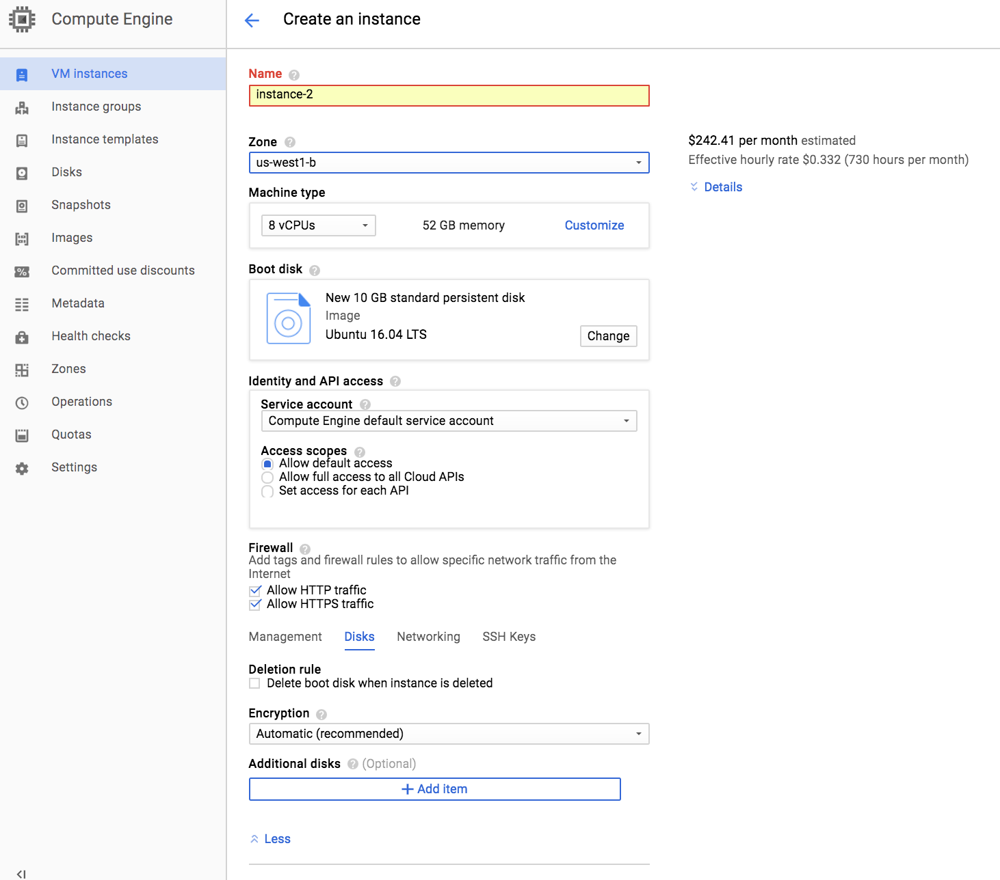
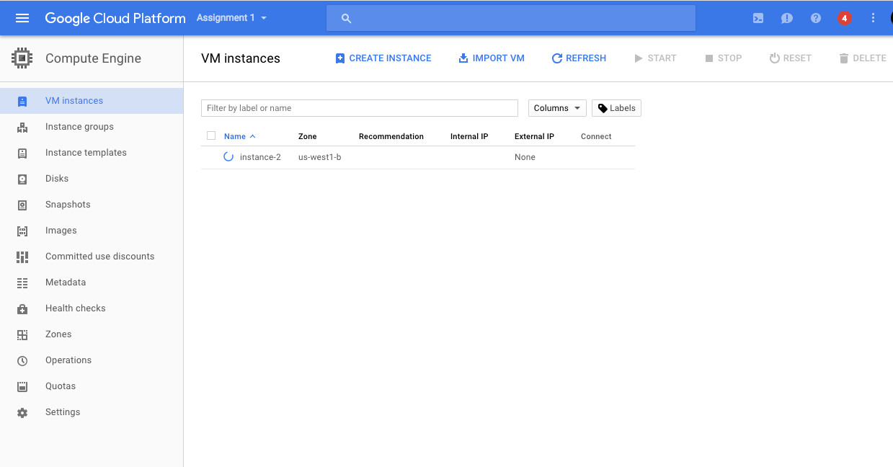

# Google Cloud Setup and Tutorial

### BIG REMINDER: Make sure you stop your instances! 

(We know you won't read until the very bottom once your assignment is running, so we are printing this at the top too since it is ***super important***)

Don't forget to ***stop your instance*** when you are done (by clicking on the stop button at the top of the page showing your instances), otherwise you will ***run out of credits*** and that will be very sad. :(

If you follow our instructions below correctly, you should be able to restart your instance and the downloaded software will still be available.

## Create and Configure Your Account

**You should use your personal GMail account for GCP, i.e. NOT OUID@ou.edu** 

For the class, we offer students **$50 GCP coupons** for each student to use Google Compute Engine for developing and testing your
implementations. When you first sign up on GCP, you will have $300 free credits.

This tutorial lists the necessary steps of working on the projects using Google Cloud. **We expect this tutorial to take up to an hour. Don't get intimidated by the steps, we tried to make the tutorial detailed so that you are less likely to get stuck on a particular step**

### Sign Up GCP for the First Time

You should receive $300 credits from Google when you first sign up with **Personal GMail** and **also UPGRADE it into a full account**. 
Please try to use the resources judiciously. 

1. Create Google Cloud account by going to the [Google Cloud homepage](https://cloud.google.com/?utm_source=google&utm_medium=cpc&utm_campaign=2015-q2-cloud-na-gcp-skws-freetrial-en&gclid=CP2e4PPpiNMCFU9bfgodGHsA1A "Title"). Click on the blue **Get Started for free** button. Sign into your Gmail account. Here is an illustrative example.

2. Choose **Account type** to be **Individual**. You will then fill in your name, address and credit card information.

3. Click the "Google Cloud Platform" (in red circle), and it will take you to the main project dashboard:

### Configure Your Project 

To change the name of your project, click on Manage project settings on the Project info button and save your changes.

## Claim GCP credits 

NOTE: You should have created and logged in your GCP account registered with your personal gmail account by now. 

1. We will release the $50 GCP credits Google form on Canvas. After your complete the form, you will see a link to Google Cloud Education Grants page. **It requires your OU email to receive the credits**. (These credits can be **applied to your GCP account registered with Personal GMail**. )

2. After submission, you should receive a email from GCP with a link to confirm your email address. Click the link to verify your OU email.

3. You will soon receive another email from GCP with a link that applys the $50 credits to your account. After that the website will jump to your [Billing](https://console.cloud.google.com/billing) page where you should see your have linked to CS231N billing account with $50 free credits. 

4. Switching billing accounts from Free Tier credits to the class credits
Google Cloud does not support combining credits. You will need to switch billing account if you want to use 2 sources of gcloud credits. 

i.e. You can use up the $300 free credits first. Then switch to the class billing account referring to this [GCloud documentation](https://cloud.google.com/billing/docs/how-to/modify-project#change_the_billing_account_for_a_project).

## Request a GPU Quota

Follow the instruction in [this link](https://docs.google.com/document/d/15qyetKk1gx3iEvrG0TDkuNwI0z9dcg2GmN0GdTBMjcs/edit#heading=h.adb3jurpnxai)
 
## Launch a Virtual Instance

To launch a virtual instance, go to the **Compute Engine** menu on the left column of your dashboard and click on **VM instances**. Then click on the blue **CREATE** button on the next page. This will take you to a page that looks like the screenshot below. **(NOTE: Please carefully read the instructions in addition to looking at the screenshots. The instructions tell you exactly what values to fill in)**.

Make sure that the Zone is set to be **us-central1-c**. Under Machine type pick the micro (1 shared vCPUs) option. Click on the **Change** button under **Boot disk**, choose **OS images**, check **Ubuntu 17.10 LTS** and click on the blue **select** button. Check **Allow HTTP traffic** and **Allow HTTPS traffic**. Click on **disk** and then **Disks** and uncheck **Delete boot disk when instance is deleted** (Note that the "Disks" option may be hiding under an expandable URL at the bottom of that webform). Click on the blue **Create** button at the bottom of the page. You should have now successfully created a Google Compute Instance, it might take a few minutes to start running. Your screen should look something like the one below. When you want to stop running the instance, click on the blue stop button above

Take note of your \<YOUR-INSTANCE-NAME>, in this case, my instance name is instance-2.

## BIG REMINDER: Make sure you stop your instances! ##

Don't forget to stop your instance when you are done (by clicking on the stop button at the top of the page showing your instances). You can restart your instance and the downloaded software will still be available.

We have seen students who left their instances running for many days and ran out of credits. You will be charged per hour when your instance is running. This includes code development time. We encourage you to read up on Google Cloud, regularly keep track of your credits and not solely rely on our tutorials.
